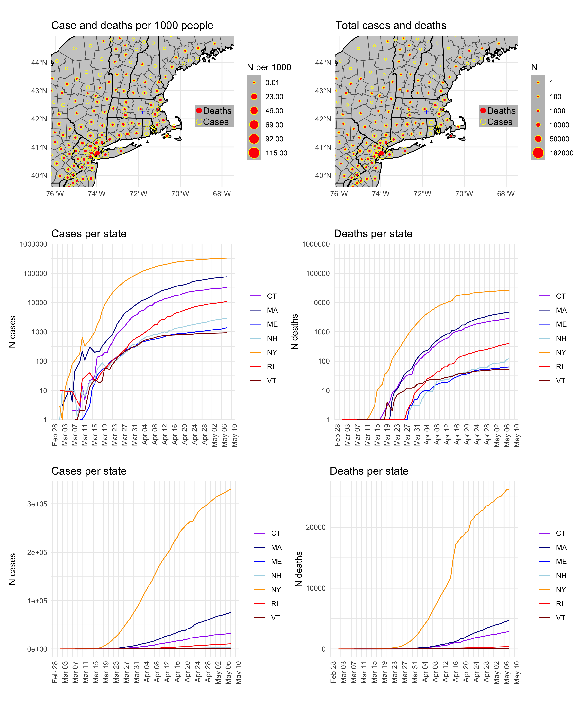

covid19clark
================

A very limited `R` package for mapping daily changes in the number of
COVID-19 cases. It uses daily data from the Johns Hopkins University
[COVID-19 repository](https://github.com/CSSEGISandData/COVID-19/), and
adapts code from Rami Krispin’s
[`coronavirus`](https://github.com/RamiKrispin/coronavirus) package
(which has a very nice interactive, global dashboard) and from several
surrounding states. The focus of this is to highlight regional changes
around a focal point, in this case Worcester, MA, the home of Clark
University. It also tries to show county-level detail available in state
datasets.

**Last update**: 2020-04-06 11:38:33


## Notes

**Updates 6 April 2020**:

  - Function added to process US cases and merge with US census data
  - Maps now presented for cases and deaths, as N per 1000 people and
    total numbers
  - State-wise cases and deaths presented on log 10 scale

**Updates 26 March 2020**:

  - Switched to read JHU [daily
    reports](https://github.com/CSSEGISandData/COVID-19/tree/master/csse_covid_19_data/csse_covid_19_daily_reports)
    exclusively. JHU time series now only summarizes for country level
    as of 22/3, [per
    notice](https://github.com/CSSEGISandData/COVID-19/issues/1250).
    These data are in a different format prior to 22/3. The earlier
    parts of the time series jump around more than in previous versions.
  - New function added to read data from daily reports
  - Dropped plot of regionalized rates of increases. Added plot of
    deaths per state.

**Updates 23 March 2020**:

  - Daily city/county/admin 2 level are now being read in from the
    [web-data
    branch](https://github.com/CSSEGISandData/COVID-19/tree/web-data/data)
    of the JHU repo.
  - Time series data are now processed from the state-level JHU data
    only. County-level data are used only for mapping.

## Disclaimers

  - **I am not an epidemiologist, so this information should not be
    taken as authoritative. There may be flaws in the code or data
    handling that give rise to misleading results.**
  - If the map is correct, it is nevertheless misleading in that the
    number of cases is almost certainly an underestimate, as US testing
    has been very limited. This statement should be uncontroversial. To
    support that claim,
    [here](https://www.cdc.gov/coronavirus/2019-ncov/cases-updates/testing-in-us.html?CDC_AA_refVal=https%3A%2F%2Fwww.cdc.gov%2Fcoronavirus%2F2019-ncov%2Ftesting-in-us.html)
    is the CDC’s page on testing rates.
    [Here](https://www.businessinsider.com/coronavirus-testing-covid-19-tests-per-capita-chart-us-behind-2020-3?op=1)
    is a comparison of the US testing rate relative to other countries.

## Installation

If you want to see the vignette and plot using data from the most recent
commit:

``` r
devtools::install_github(build_vignettes = TRUE)
```
