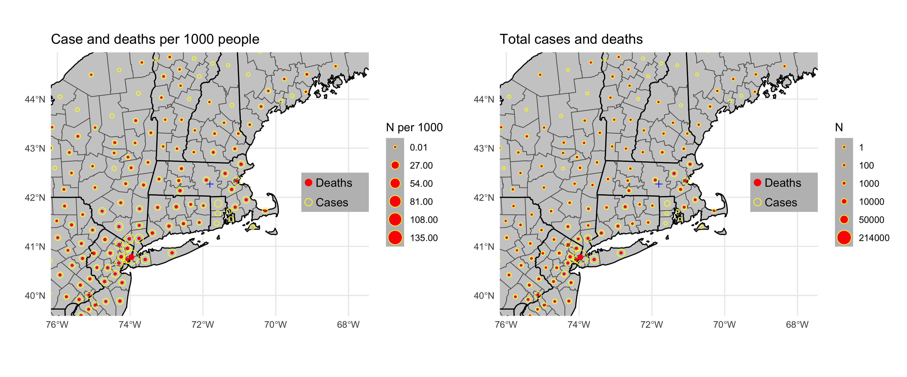

covid19clark
================

A very limited `R` package (with no functions and just one vignette)
that can be used to get daily updates of changes in the distribution of
COVID-19 within a limited geographic extent centered on a city of
interest, in this case Worcester, MA, the home of Clark University.

The repo contains code to pull daily data from the Johns Hopkins
University [COVID-19
repository](https://github.com/CSSEGISandData/COVID-19/), and adapts
code from Rami Krispin’s
[`coronavirus`](https://github.com/RamiKrispin/coronavirus) package,
which has a very nice interactive, global dashboard.

This packages was made to highlight the regional change, and to try
resolve some of the county level detail available in source datasets, to
track finer spatial changes.

**Last update**: 2020-03-22 00:05:52


## Notes

**Updated 21 March 2020**:

  - County-level data are now being read from Massachusetts DPH, found
    [here](https://www.mass.gov/info-details/covid-19-cases-quarantine-and-monitoring),
    and also \[Connecticut\[(<https://portal.ct.gov/Coronavirus>). These
    are really the only useful county-level data available at this stage
    on the maps, which is why the two states are shaded differently (top
    left).
  - Time series data are now processed from the state-level JHU data
    only. County-level data are used only for mapping.

## Disclaimers

  - **I am not an epidemiologist, so this information should not be
    taken as authoritative. There may be flaws in the code or data
    handling that give rise to misleading results.**
  - If the map is correct, it is nevertheless misleading in that the
    number of cases is almost certainly an underestimate, as US testing
    has been very limited. This statement should be uncontroversial. To
    support that claim,
    [here](https://www.cdc.gov/coronavirus/2019-ncov/cases-updates/testing-in-us.html?CDC_AA_refVal=https%3A%2F%2Fwww.cdc.gov%2Fcoronavirus%2F2019-ncov%2Ftesting-in-us.html)
    is the CDC’s page on testing rates.
    [Here](https://www.businessinsider.com/coronavirus-testing-covid-19-tests-per-capita-chart-us-behind-2020-3?op=1)
    is a comparison of the US testing rate relative to other countries.

## Installation

If you want to see the vignette and plot using data from the most recent
commit:

``` r
devtools::install_github(build_vignettes = TRUE)
```
