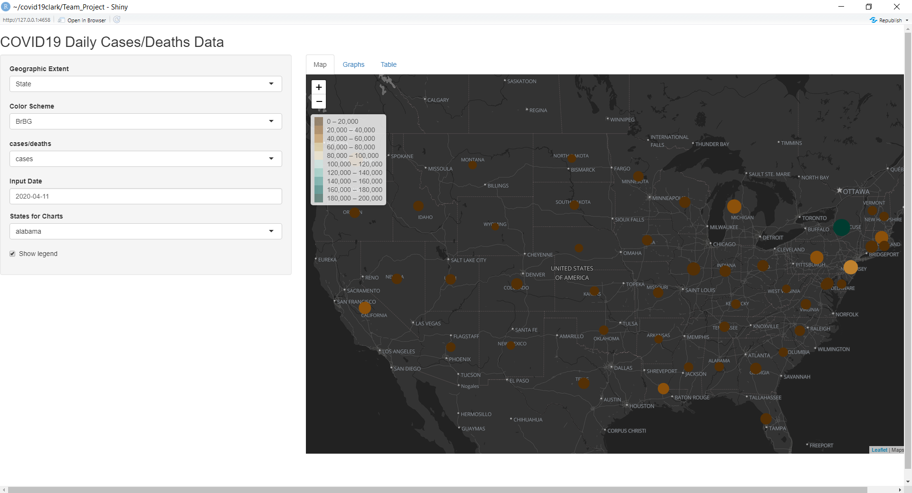
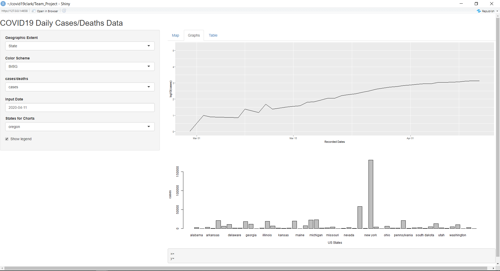
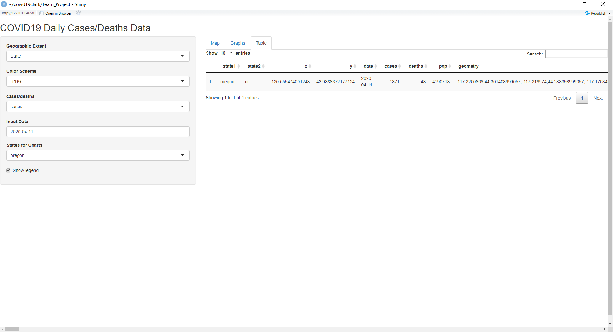

# Introduction

The goal of this project was to provide accurate and visually appealing displays
of daily COVID-19 data pulled from Johns Hopkins University (JHU) including both
case and death data for county and state level depiction in the United States. 
We retrieved our data from the COVID19clark package, which summarized and 
formatted the JHU data. The output dataset, “us_cases_daily.rda” was used as the
basis for both applications. Two different packages were used (Plotly and Shiny)
in order to compare the abilities of two methods in terms of their displaying 
capabilities. Plotly mainly depicts case and death data at the county level, 
while Shiny depicts both case and death data at the county and state level, for 
every day since the first day of recording. Both packages provide users the 
ability to create interactive maps and charts and can be implemented into a 
dashboard for better interpretability. Our project explores functions of both 
packages in order to determine the benefits and drawbacks of using one package 
over another and focuses on ways in which we can most accurately display 
COVID-19 case and death data. 

---

# Methods

## Plotly

One of our methods encompassed the use of the Plotly package, a free R package 
that uses the open source JavaScript graphing library and allows users to 
create interactive graphics and maps including scatter plots, lines plots, 
histograms, box plots, etc. It can be downloaded from CRAN (using the install.package() function) or Github (using the devtools::install_github() function) and uses htmlwidgets to create maps and interactive dashboards. In this project, we created a dashboard for our Plotly maps which allows users easier access to our results and provides them with a platform in which to interact with the final maps. Using the Plotly package, we were able to create four interactive choropleth maps. These maps have a hover capability which allows users access to
important information by just holding their cursor over a certain region on the 
map. Additionally, the Plotly maps were created using mapbox, an open source 
mapping platform in order to allow users to view world geography, providing for 
a more visually appealing display of the COVID-19 data. 

## Shiny

Our second method uses Shiny, a free R package developed by R Studio Inc. that allows users to create interactive web apps. The package is built from Javascript primarily but also contains some elements of HTML. Shiny can be implemented in HTML, CSS, or Javascript, each containing various capabilities. The package can be downloaded from CRAN (using the install.package() function) or from Github (using the devtools::install_github() function) and is capable of showing interactive maps and data tables, which is especially compatible with the COVID-19 dataset we retrieved from Johns Hopkins University (JHU). Using the Shiny package, we created a web application that contains a Leaflet map which we overlaid with the COVID-19 data (from JHU); a graph and a chart of the 
cases/deaths/case rate/death rate data; and a table showing the data for each county which is sorted by state. Each of these features within the Shiny app, are embedded in a window that is created when Shiny is initialized, and organized into tabs. On the left hand-side of the window, there are options for the user to change the color pallete, the geographic extent, the date of the reported cases/deaths, and whether to display cases, deaths, case rate, or death rate. The COVID-19 data is represented in the Leaflet map window with a basemap imported from Leaflet’s website. The COVID-19 data is overlaid on top with coloration and circle polygon size dependent on the values. If the geographic extent or any of the other options related to the map (type of data, data recorded, color palette) is changed, the map will update accordingly. Similarly, the graph and chart in the second tab (labeled graphs) and the table in the third tab (labeled table) will also update accordingly, with the added plus of user abilitiy to select 
specific states of interest. 

---

# Data Visualizations

```{r echo=FALSE, message=FALSE, warning=FALSE}
#Setup
library(ggplot2)
library(tidyverse)
library(COVID19)
library(covid19clark)
data("us_counties")
data("us_cases_daily")
library(devtools)
library(dplyr)
library(stringr)
library(maps)
library(mapdata)
library(ggmap)
library("rnaturalearth")
library("rnaturalearthdata")
library("sf")
```

## Chart 1

```{r echo=FALSE, message=FALSE, fig.align='center', fig.width=11.5, fig.height= 6.5}

 ggplot() + geom_histogram(data = us_cases_daily$county %>% 
                              filter(.$cases > 0),
             aes(x = x, fill = "cases"), color = "white") + 
  geom_histogram(data =us_cases_daily$county %>% filter(.$deaths > 0), 
             aes(x = x, fill = "deaths"), color = "white") + 
    labs(title="Histogram Showing U.S. Cases and Deaths", 
         x = "Longitude", y = "Cases/Deaths") +
  theme(plot.title = element_text(hjust = 0.5)) + theme(legend.title = element_blank())

```

## Chart 2

```{r echo=FALSE, message=FALSE, fig.align='center', fig.width=11.5}

state_cases <- us_cases_daily$state %>% group_by(state1) %>% select(cases) %>% 
  summarise(maxcases = max(cases))
 barplot(state_cases$maxcases, main = "Number of COVID-19 Cases by State", 
         xlab = "U.S. States and Territories", ylab = "Number of Cases", 
         names.arg = c(1:52), col = "purple")

```

## Chart 3

```{r echo=FALSE, message=FALSE, fig.align='center', fig.width=11.5}

state_deaths <- us_cases_daily$state %>% group_by(state1) %>% 
    select(deaths) %>% summarise(maxdeaths = max(deaths)) 
  barplot(state_deaths$maxdeaths, main = "Number of COVID-19 Deaths by State", 
          xlab = "U.S. States and Territories", ylab = "Number of Deaths", 
          names.arg = c(1:52), col = "purple")

```


---

# Results

## Plotly

With Plotly we focused on a four panel comparison of cases and deaths maps 
including a map of cases by county within the U.S. (Map 1), a map of deaths by 
county within the U.S. (Map 2), a map displaying cases per 1000 people by county
within the U.S. (Map 3), and a map displaying deaths per 1000 people by county 
within the U.S (Map 4). These maps provide an accurate depiction of the counties
in the U.S. where the most cases and deaths are. The user has the ability to 
hover over each of the four maps with their cursor and will be provided 
different information depending on which map they hover over. For Map 1, the 
hover information will include the name of each county, the population of each 
county, and the number of cases in each county. The hover information for Map 2,
includes the same information, but rather than the number of cases in each 
county it shows the number of deaths in each county. Map 3 includes hover 
information about cases by county within the U.S. in addition to cases per 1000 
people by county within the U.S. and does not include death information. Lastly,
Map 4 includes hover information about death by county within the U.S. and 
deaths per 1000 people by county within the U.S. and does not include case 
information. In addition to hover information, users can interact with all four 
maps by clicking and dragging the maps in each frame and zooming in and out with
their cursor. These functions can also be used with the Plotly options in the 
upper left corner that appear when the user hovers over each map. These options 
include the ability to download the maps as png files; the ability to pan, zoom 
in, zoom out, box select, lasso select, reset view; and the ability to toggle 
show the closest data on hover. Lastly, the user has the ability to view the 
dashboard in a browser window in html format. 


```{r echo=FALSE, message=FALSE, warning=FALSE}
library(flexdashboard)
library(plotly)
library(COVID19)
library(covid19clark)
library(tigris)
data("us_counties")
data("us_cases_daily")
data("fips_codes")
library(tidyverse)
library(geospaar)
library(dplyr)
library(RColorBrewer)
library(gplots)

```


```{r echo=FALSE, message=FALSE, warning=FALSE}
pal <- RColorBrewer::brewer.pal(9, "OrRd")
df <- as.tibble(us_cases_daily$county)
fips <- fips_codes
fips$county <- str_remove(fips$county, " County")
fips$county <- tolower(fips$county)
fips$state_name <- tolower(fips$state_name)
df <- df %>% left_join(fips, by = c("state1" = "state_name", "county.x" = "county")) %>%
    mutate(., FIPS = paste0(state_code, county_code)) %>% filter(!is.na(date) & (cases > 0))
df <- df %>% filter(df$date == max(df$date))
classInt <- classInt::classIntervals(df$cases, 8, style = "jenks")
df <- df %>% mutate(breaks = cut(cases, breaks = classInt$brks)) %>% filter(!is.na(breaks)) %>% group_by(breaks)
library(rjson)
url <- 'https://raw.githubusercontent.com/plotly/datasets/master/geojson-counties-fips.json'
counties <- rjson::fromJSON(file=url)
g <- list(
    scope = 'usa',
    projection = list(type = 'albers usa'),
    showlakes = TRUE,
    lakecolor = toRGB('white')
)


fig1 <- plot_ly()
colorscale= pal

df$county_capital <-  gsub("(^|[[:space:]])([[:alpha:]])", "\\1\\U\\2",   
     df$county.x,
     perl = TRUE)
df$hover <- paste(df$county_capital, '<br>', "Cases:", df$cases, '<br>', "Population:", df$pop)
fig1 <- fig1 %>% add_trace(
    type="choroplethmapbox",
    geojson=counties,
    locations=df$FIPS,
    z=log10(df$cases),
    colors = colorscale,
    zmin=log10(min(classInt$brks)),
    zmid=log10(median(classInt$brks)),
    zmax=log10(max(classInt$brks)),
    marker=list(line=list(width=0)),
    text = df$hover,
    hoverinfo = "text"
)

m <- list(
  l = 0,
  r = 0,
  b = 0,
  t = 0
)
fig1 <- fig1 %>% colorbar(title = "COVID-19 Cases <br> (Log Values)", limits = log10(c(1, 40000)))
fig1 <- fig1 %>% layout(
     geo=g
)

fig1 <- fig1 %>% layout(margin = m,
    mapbox=list(
        style="carto-positron",
        zoom =2.6,
        center=list(lon= -95.71, lat=37.09))
)
fig1
```


## Shiny 

With Shiny we created one full size map of the U.S. in an interactive dashboard 
that contains multiple dropdown menus on the left hand side of the display. The 
first two menus allow the user to choose the geographic extent and color scheme 
of the map. There are two geographic extents to choose from so users have the 
ability to either view cases or deaths by state or cases or deaths by county. 
The color scheme drop down menu contains 27 color schemes to choose from. There 
is also a dropdown option that allows users to switch between cases and death 
data so that one or the other will be displayed on the map. This option also 
includes the death rate which is the number of deaths per 1000 people and the 
case rate which is the number of cases per 1000 people. Additionally, users have
the capability of choosing an input date, allowing them to observe case and 
death data for a specific month and day. The right hand side of the dashboard 
display includes our full sized map which will show each option that is chosen 
with the drop down menus on the left. Above the full sized map there are three 
tabs which allow the user to switch between pages. The first one includes the 
map just described with the option to zoom in and out and pan on the map. The 
second tab shows graphs of the COVID-19 data including a chart of cases by 
recorded data and a histogram showing cases per state. Both of these charts are 
stagnant and do not have interactive capabilities but the first chart includes a 
dropdown menu on the left hand side of the page that allows the user  to switch 
between different states. The last tab shows the data table of the COVID-19 
us_cases_daily data including state names, x and y coordinates, dates, cases, 
deaths, and population. Lastly, the user has the ability to view the dashboard 
in a browser window in html format. 





---

# Discussion

## Plotly

The Plotly package is great for creating interactive visualizations that can be 
embedded into html for online viewing, but it does come with a couple of 
disadvantages. Firstly, the plots you make are always public and can be viewed 
by anyone. Therefore, if you would rather your maps be private to avoid 
plagiarism, for example, you may want to think about using a different package. 
Another disadvantage of Plotly, is the limited color options so creating maps 
that display your data as accurately as possible can be challenging with limited
color schemes available. For the Plotly aspect of our project we created four 
successful visualizations of cases and deaths in the United States but there are
other things we could do to make these visualizations even more successful and 
interactive. Some of these aspects are included in our Shiny part of the 
project, such as drop down menus for users to interact with and tabs for users 
to switch between multiple pages. Our Plotly maps could be strengthened by 
adding drop down menus so that users can choose between different color schemes,
switch between case and death data, view the map in scatterplot form versus 
choropleth form, etc. It would also be beneficial to have multiple tabs in order 
to switch between pages like we have done with our Shiny work. It would be 
interesting to include a page of histograms for example as well as box plots and
basic charts that could be interactive using the Plotly package. It may even be 
exciting to try switching between multiple large interactive maps rather than 
including a multiple plot layout like we have done with our four maps. Overall, 
our results are successful for displaying COVID-19 case and death data but there
is more we could do to add further interactive aspects to our project. 

## Shiny

For the Shiny aspect of our project we created a successful full sized map 
of the United States with several interactive capabilities including drop down 
menus and multiple tabs. There are drawbacks, however, as there are limitations 
to the functions and widgets you can add to the interface. It is also not 
accessible in regards to the stylization of the app, as knowledge of CSS is 
required to carry out extensive stylistic changes. Additionally, the integration of interactive functions such as Leaflet are buggy and occasionally have issues displaying data correctly (mainly out of it being a recently made package). Finally, there are some errors in regards to publishing the app on RStudio’s designated web app publishing server, as the app we created would not upload. In continuing this work into the future, it would be beneficial to add dropdown menus to our various tabs so that the dropdown menus on each tab correspond to the information displayed on a specific tab. For example, we have housed all of our dropdown menus on the first page of the Shiny app which all correspond to the map on that page except for the last dropdown menu which corresponds to the 
charts on our graphs tab. For the future, it would be beneficial to move this 
dropdown menu to the graphs tab. Additionally, it would be beneficial to make the
charts on our graphs tab interactive so that users can switch between graphs of 
different data aspects such as cases versus deaths or county versus state. As 
with the Plotly aspect of our project, our results are successful for displaying
COVID-19 case and death data but there is more we could do to make our results 
even more successful. As more and more data is being created each day, there are
more and more aspects that could be exciting to include in our project and we 
hope to both be a part of continuing this work into the future. 


